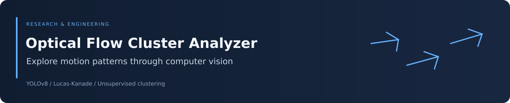
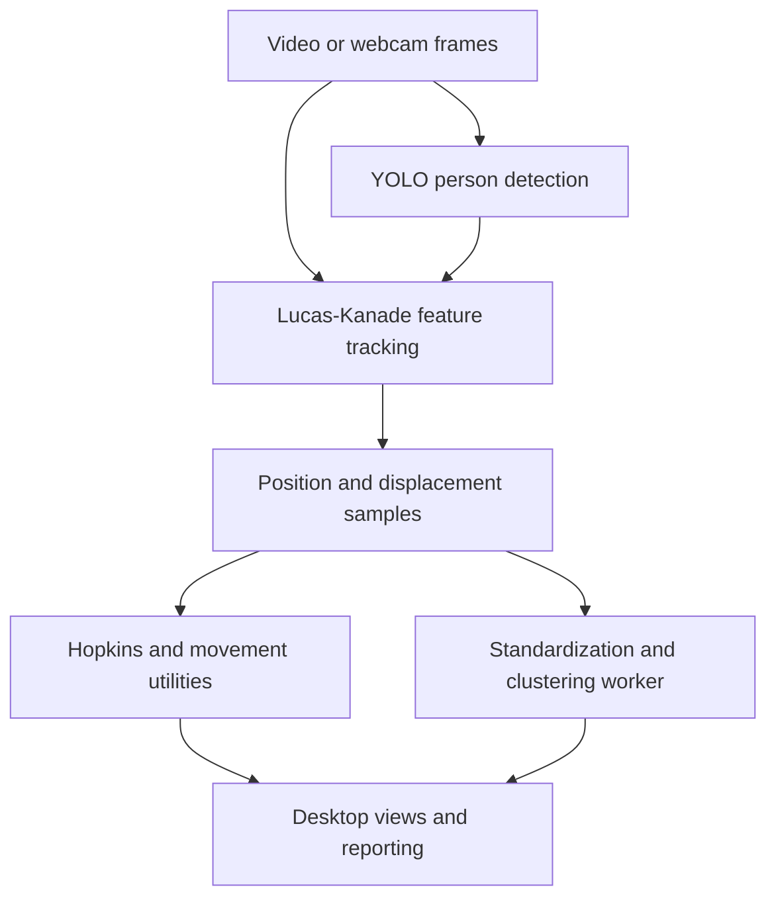

<div align="center">



# Optical Flow Cluster Analyzer

### Human movement exploration with person detection, optical flow, and clustering


[Overview](#overview) · [Architecture](#architecture) · [Methods](#analysis-methods) · [Setup](#setup-and-current-launch-status) · [Limitations](#interpretation-and-verification)

</div>

## Overview

Origin of Human Movement contains the Optical Flow Cluster Analyzer (OFCA), a desktop research prototype for exploring motion patterns in videos and webcam streams. It combines YOLOv8 person detection, Lucas–Kanade optical flow, clustering, and movement-analysis utilities.

The repository includes a large single-file implementation and a modular refactor under `ofca_project`. **The modular refactor is incomplete.** Interface controls and analysis modules are present, but several callbacks and visualization functions are unfinished; a fully working desktop application is not established by the current checkout.

“Origin of movement” refers to application-specific visual analysis and stored motion signatures. It is not a validated biomechanical, neurological, or causal explanation of human movement.

## Repository guide

| Resource | Role |
|---|---|
| [Legacy single-file source](Human%20origin%20movement%20analysis.py) | Earlier monolithic implementation |
| [ofca_project/main.py](ofca_project/main.py) | Refactored desktop entry point |
| [ofca/app.py](ofca_project/ofca/app.py) | PyQt6 window and control flow |
| [vision](ofca_project/ofca/vision) | Person detection and optical-flow processing |
| [analysis](ofca_project/ofca/analysis) | Clustering worker, fluidity heuristics, and quality utilities |
| [ui](ofca_project/ofca/ui) | Tabs, dialogs, and visual styling |
| [io/reporting.py](ofca_project/ofca/io/reporting.py) | CSV, JSON, HTML, and spreadsheet export routines |
| [utils](ofca_project/ofca/utils) | Metric helpers and incomplete overlay functions |

Model-weight files are committed at the repository root and inside `ofca_project`. Their presence does not establish that all model choices or both source versions have been verified.

## Architecture



The diagram describes the intended refactored pipeline. The integration boundaries and unfinished callbacks below affect its current runtime completeness.

## Analysis methods

### Optical flow

Lucas–Kanade feature tracking estimates displacement between neighboring frames:

$$
\Delta\mathbf p_t = \mathbf p_t-\mathbf p_{t-1}.
$$

Flow samples combine image position and displacement. These are pixel-domain measurements, not calibrated physical speed, joint angles, or anatomical trajectories.

The detector selects YOLO's person class and returns bounding boxes. The refactored detector is not a skeleton-pose estimator merely because pose weights also exist elsewhere in the repository.

### Clustering worker

The worker stacks stored flow samples, randomly subsamples to at most 5,000 rows, and standardizes their columns before clustering.

| Method | Implemented selection |
|---|---|
| K-Means | Candidate cluster counts 2–10, bounded by sample count; best silhouette score |
| Hierarchical | Agglomerative clustering with the same candidate-count search |
| DBSCAN | Configured `eps` and `min_samples` |
| OPTICS | Configured `min_samples`, with `xi=0.05` |

The worker runs all four methods even though it accepts the interface's selected method. The `eps` value is used for DBSCAN; it is not passed into the current OPTICS constructor. Errors within an algorithm can yield an all-zero label array, which must not be treated as a successful discovered cluster structure.

K-Means uses a fixed seed; the initial 5,000-row subsampling does not. Repeated analyses can therefore differ.

### Clusterability and movement summaries

The metric helper computes a Hopkins-style ratio of nearest-neighbor distances. In the refactor it uses the first two columns of flow data, meaning **spatial feature positions**, not necessarily motion-vector components.

Movement-quality utilities include threshold-based labels and a Random Forest training path. The repository does not supply a validated trained movement-quality classifier. Threshold-derived labels are heuristics, not independent ground truth.

## Setup and current launch status

```bash
git clone https://github.com/Foysal-A-Al/Origin-of-Human-Movement.git
cd Origin-of-Human-Movement
python -m venv .venv
```

Activate with `source .venv/bin/activate` on Linux/macOS or `.venv\Scripts\Activate.ps1` in Windows PowerShell.

The refactored entry point is:

```bash
cd ofca_project
python main.py
```

This is an entry-point reference, **not a verified quick-start command**. Resolve the documented integration gaps before expecting a complete session.

### Dependency and integration gaps

| Area | Current finding |
|---|---|
| Qt | Source imports PyQt6; refactored requirements pin PyQt5 |
| Detector | Source imports Ultralytics, absent from refactored requirements |
| Application imports | A Twisted `tkconch` import is present outside the core analysis dependency set |
| UI callbacks | Several update and clustering-result methods called by the application are not implemented |
| Visualization | Heatmap, trails, and centroid overlay functions are placeholders |
| Resources | Icon paths and model-weight names resolve from the working directory |
| Export | Spreadsheet export requires a compatible writer engine; end-to-end formats are unverified |

The requirements file should not be described as a complete runtime environment until those mismatches are resolved. Installing missing packages alone does not complete the refactor.

The intended interface offers video loading, webcam control, model selection, analysis settings, views, and export. Their presence in the UI is not evidence that every action works.

## Interpretation and verification

Current source-level findings require care:

- Pixel displacement depends on camera motion, scene scale, frame rate, and tracking quality.
- Feature positions and displacements are combined in clustering; feature scaling and camera coordinates influence results.
- Stored time values use `frame_count / 30`; they do not necessarily reflect the source video's actual frame rate.
- Low or high Hopkins values do not establish biomechanical fluidity or clinical movement quality.
- Algorithm error fallbacks can resemble ordinary outputs.
- Ground-truth evaluation requires genuinely independent labels and explicit alignment to frames or windows.

No automated test suite, CI workflow, verified GUI session, or clinical validation is included. This README update checks documentation against source structure; it does not claim a completed application repair.

## Reproducibility guidance

For a movement experiment, preserve the source video identifier, frame rate, resolution, detector/weight versions, detection threshold, tracking settings, feature-column definitions, clustering parameters, seeds, and independent labels.

Separate exploratory visualization from validated measurements. Document all downsampling, missing tracks, and error fallbacks before reporting aggregate metrics.

## Development priorities

Potential work, not completed features:

1. Align dependencies and complete application callbacks.
2. Replace placeholder overlays with tested implementations.
3. Standardize resource paths and timestamp handling.
4. Add deterministic numerical and integration tests.
5. Validate exported results against independent movement annotations.

## Attribution and citation

Maintained by [Abdullah Al Foysal](https://github.com/Foysal-A-Al). The project uses OpenCV, PyQt6, scikit-learn, and Ultralytics components; preserve applicable third-party notices and weight-use terms.

For research use, cite this repository URL and the exact commit used, alongside the relevant methods and dataset sources. No repository license file is currently included; clarify reuse permissions before redistribution.
